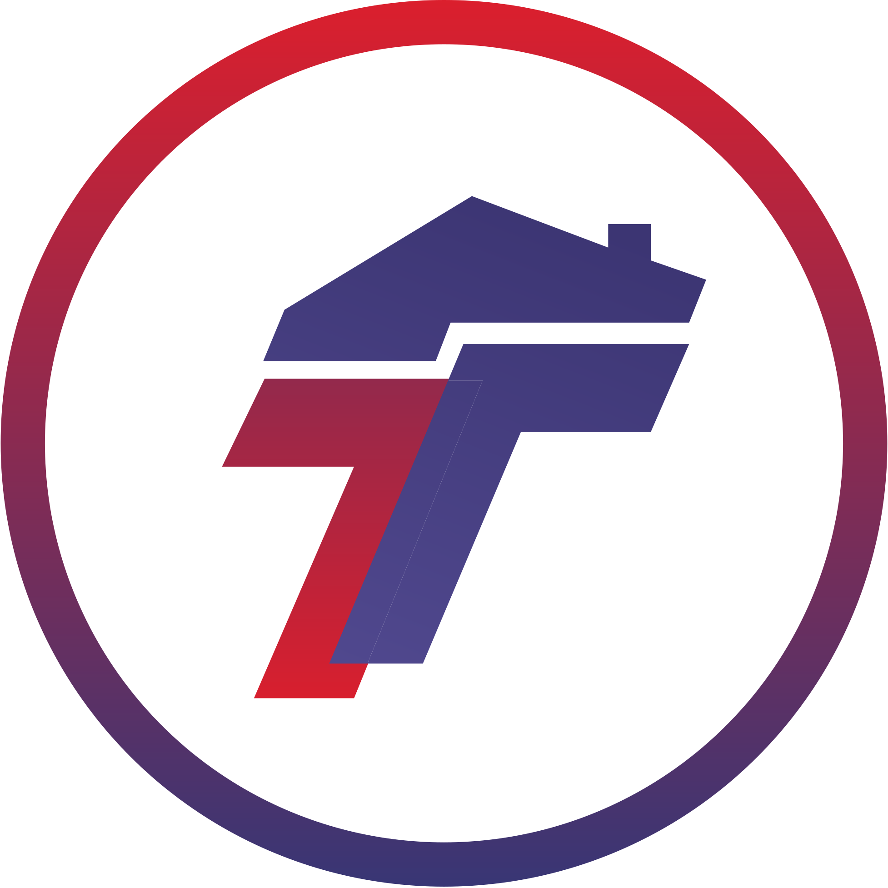

<div align="center">



# TCHB TC Checklist

### A real-time first-call checklist for the Total Cash Home Buyers Transaction Coordination team

A guided, synced, installable checklist that walks Transaction Coordinators through every question to ask on the first call with a seller — so nothing gets missed, and progress is shared live across the team.

<br/>


</div>

---

## 📌 Overview

**TCHB TC Checklist** is an internal tool for the Total Cash Home Buyers (TCHB) Transaction Coordination team. During a seller's first call, the coordinator works down a structured checklist covering everything that needs to be asked and confirmed — mortgage details, photos, emergency contacts, HOA specifics, property-type questions, and more. Every checkbox is synced in real time through Firebase, so the call's progress is visible to the whole team, survives a refresh or device switch, and can be printed or reset for the next call.

The app is an installable **Progressive Web App** with offline support, so it loads instantly and keeps working even on a flaky connection in the field.

---

## ✨ Features

### Guided first-call workflow
- A complete, sectioned checklist covering the full first-call script: **Mortgage Questions, Pictures, Emergency Contact Info, HOA Questions, SFHs, Land, Income-Producing Properties,** and **Mobile Homes**.
- One-tap checkboxes keep the coordinator moving through the call without losing their place.
- **Print** the completed checklist for the file, or **Reset Call** to start fresh for the next seller.

### Real-time team sync
- Checklist state is stored in **Firebase Firestore** and synced live — refresh, switch from desktop to phone mid-call, or hand off to a teammate without losing a single check.
- **Live presence** shows how many coordinators are active right now, with per-user desktop/mobile indicators.

### CRM-connected
- Attach a **CRM lead link** (GoHighLevel) to each checklist so the call is tied directly to the right lead record.

### Secure & access-controlled
- **Google OAuth** sign-in.
- **Domain-restricted** — only `@totalchb.com` accounts are admitted; anyone else is signed straight back out with an "Access Denied" message.

### Built for the field
- Installable **PWA** with a service worker that caches the app shell for **offline / low-signal** use.
- Immersive dark glassmorphism UI, custom cursor with a reactive mouse glow, and an animated canvas spark background (desktop), with a clean touch-optimized layout on mobile.

---

## 🛠️ Tech Stack

| Layer | Technology |
|-------|------------|
| **Frontend** | HTML5, Vanilla JavaScript (single-file app) |
| **Styling** | Tailwind CSS (CDN), Font Awesome 6, Plus Jakarta Sans |
| **Database** | Firebase Firestore (real-time sync) |
| **Auth** | Firebase Auth — Google provider, domain-restricted |
| **CRM** | GoHighLevel lead link |
| **App shell** | Progressive Web App + Service Worker (offline cache) |
| **Hosting** | Static host (e.g. Vercel) |

---

## 📁 Project Structure

```
.
├── index.html          # The entire app — checklist UI, auth, real-time sync, presence
├── service_worker.js   # Caches the app shell for offline / low-signal use
├── manifest.json       # PWA manifest (installable app metadata)
├── icon.svg / icon.png # App icons
└── logo.svg            # Brand asset
```

---

## 🔄 How it works

```
Coordinator signs in with Google
        │
        ▼
@totalchb.com verified  ──►  anything else is signed out ("Access Denied")
        │
        ▼
Work down the first-call checklist  ──►  each check writes to Firestore (debounced)
        │
        ├──►  Live sync to every other open session
        ├──►  Presence updates ("active coordinators" count)
        └──►  Optional CRM lead link attached
        │
        ▼
Print for the file  ·  or  ·  Reset Call for the next seller
```

Checklist and presence data live under an `artifacts/{appId}/public/data/…` structure in Firestore (`checklists` and `active_users` collections), and a coordinator is considered "online" if any of their sessions has checked in within the last five minutes.

---

## 🚀 Getting Started

### Prerequisites
- A Firebase project with **Firestore** and **Authentication** enabled
- A static host (e.g. **Vercel**) for the frontend

### 1. Clone the repository
```bash
git clone https://github.com/RemyTCHB/TCHB-TC-1ST-CALL.git
cd TCHB-TC-1ST-CALL
```

### 2. Configure Firebase
Drop your own Firebase web config into the config block in `index.html`:
```js
const firebaseConfig = {
  apiKey: "…",
  authDomain: "your-project.firebaseapp.com",
  projectId: "your-project",
  storageBucket: "your-project.firebasestorage.app",
  // …
};
```
> The Firebase web API key is **not** a secret — access is protected by the domain check and your Firestore Security Rules (below).

### 3. Set the access domain
The domain gate is enforced in `index.html` (`email.endsWith('@totalchb.com')`). Change that string if you deploy for a different organization.

### 4. Deploy
Serve the static files from any host. On **Vercel**, connecting the GitHub repo auto-deploys on every push to `main`.

> ⚠️ Add your production domain (and `localhost` for testing) to **Firebase Console → Authentication → Settings → Authorized Domains**, or the Google Sign-in popup will be blocked.

---

## 🔒 Security

Access is gated on the frontend by Google sign-in plus the `@totalchb.com` domain check, but the real boundary should be enforced in **Firestore Security Rules** so the database is locked down even if the client is inspected. A domain-scoped rule looks like:

```
rules_version = '2';
service cloud.firestore {
  match /databases/{database}/documents {
    match /{document=**} {
      allow read, write: if request.auth != null
        && request.auth.token.email_verified == true
        && request.auth.token.email.lower().split('@')[1] == 'totalchb.com';
    }
  }
}
```

Using exact domain matching (`split('@')[1] == 'totalchb.com'`) plus `email_verified` avoids the partial-match pitfalls of a substring regex. Test rule changes in the Firebase Rules Playground before publishing.

---

## 📄 License

Internal proprietary tool — © Total Cash Home Buyers. All rights reserved.

<div align="center">
<br/>
<sub>Built for the TCHB Transaction Coordination team 📋</sub>
</div>
